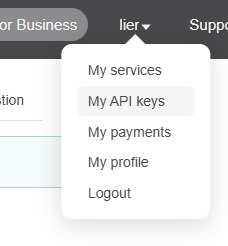
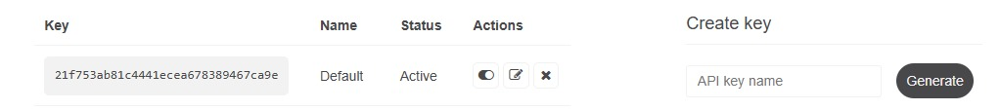
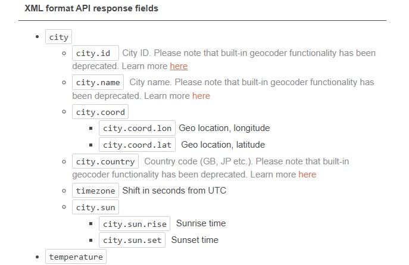
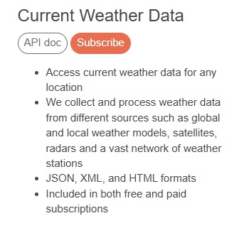
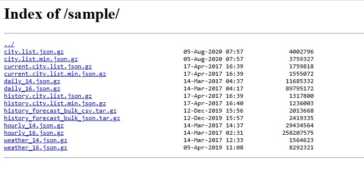
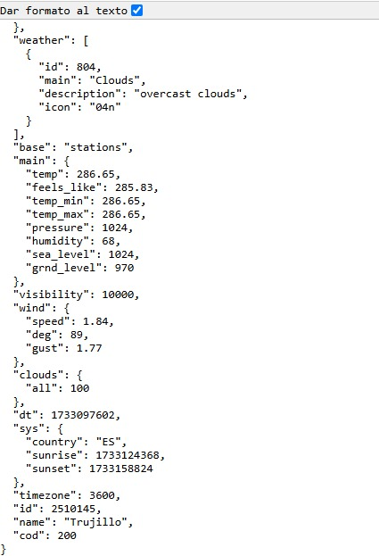

# Ejercicio 4: 

## Realizar una llamada API de OpenWeather 
¿Que es OpenWeather?

´´´ 
Es un servicio
´´´

Para realizar una llamada con API desde OpenWeather puede haber varias manera, pero intentaremos ver una manera algo sencilla

1) Ir a la pagina de OpenWeather usando el link:
   openweathermap.org

   
2) Registrarse y crear un nombre de usuario:
   
3) Una vez terminado el registro hacemos click en nuestro nombre de usuario en la parte superior derecha y hacemos click en My Api Keys para ver que Apis tenemos

4) Como se puede apreciar, este fue el Api que tenemos por defecto, que se puede agregar algo nuevo o borrarlo

   
5) Una vez que hallamos visto la Api que tengamos vamos a tratar de realizar una llamada API de Open Weather
6) Para comenzar debemos de saber cual es la ciudad la cual debemos de conectar, para eso entramos a API usando este url: https://openweathermap.org/api o hacerle click a API que esta en la parte superior

7) Una vez entrado ahi debemos acceder a Current weather data si es que quedemos observar en tiempo real el clima

8) De ahi podemos usar el ID por ciudad o entrar por este url https://bulk.openweathermap.org/sample/
9) De todas las opciones que nos aparecen seleccionamos la primera que dice:
 city.list.json.gz  y se nos descargara un archivo la cual nos va a mostrar todas las ID de casi todas las ciudades existentes, es un archivo grande y cargara muy lento, asi que recomendable buscar una ciudad rapido

10) Seleccionamos la ciudad de preferencia, y ahora pasemos a la ultima parte
11) Para hacer una llamada tenemos que copiar la siguiente URL: https://api.openweathermap.org/data/2.5/weather?id=(ID de la ciudad seleccionada)5&appid=(nuestro API KEYS) y nos debe salir un resultado similar.

