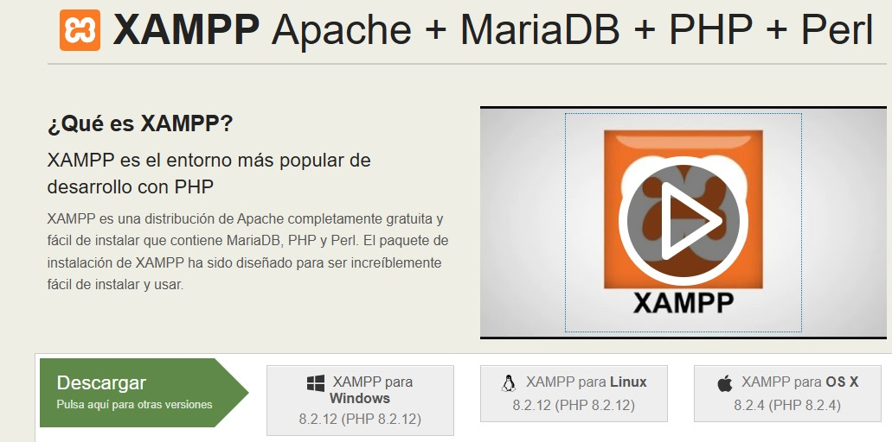
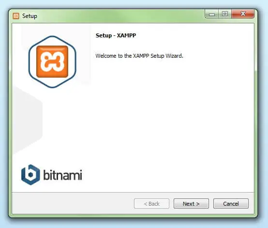
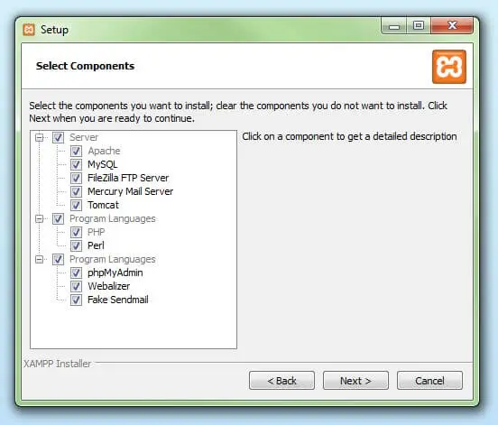
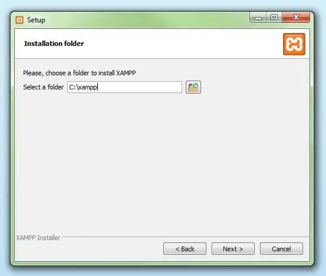
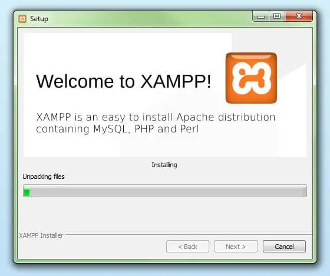
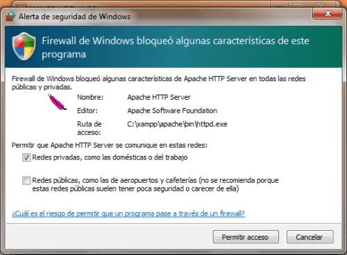
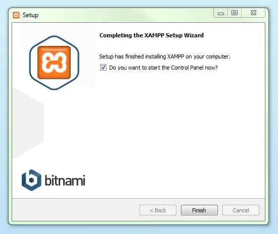

# Instalación XAMPP
## ¿Que es XAMPP?
 ``` bash
Es una distribucion de Apache que incluye varios software libres.
El mismo XAMPP es un acronimo de los progranas que lo contribuyen:
X para dejar en claro que se usada en Windows o linux,
A del servidor web de Apache,
M relacionado a la base de datos com MySQL o MariaDB,
P del lenguaje de programación PHP y P otro lenguaje de programación Pearl
 ```

## ¿Como descargar XAMPP?
### Primer paso:
-Descargarlo por la pagina oficial del XAMPP, elegir si lo quieres descargar en windows o linux como tambien escoger la version correspondiente: https://www.apachefriends.org/es/index.html.



### Segundo paso:
-Una vez descargado el archivo debemos ejecutar el archivo .exe.
-Puede aparecer un mensaje del sistema preguntandote si permites que la aplicación realice cambios, debemos darle click a "aceptar".

### tercer paso:
-Aparecera una pantalla de inicio de instalación para XAMPP, para eso debemos darle click a "next" un par de veces para ajustar las configuraciones.



### Cuarto paso:
-Aparecera algo para seleccionar los componentes que deseamos instalar, por defecto se marcaran: Apache, MySQL, PHP y PHPMyAdmin. Se recomienda la configuración estándar para un servidor de prueba local.



### Quinto paso:
-En este paso se elige la ubicación donde deseas instalar XAMPP. Por defecto, en Windows será "C:\xampp", luego damos click en next.



### Sexto paso:
-El asistente extrae los componentes seleccionados y los guarda en el directorio escogido en un proceso que puede durar algunos minutos.
El avance de la instalación se muestra como una barra de carga de color verde.



### Septimo paso:
-Durante el proceso de instalación es frecuente que el asistente avise del bloqueo de Firewall. En la ventana de diálogo puedes marcar las casillas correspondientes para permitir la comunicación del servidor Apache en una red privada o en una red de trabajo. Recuerda que no se recomienda usarlo en una red pública.



### Octavo paso:
-Una vez extraídos e instalados todos los componentes debemos asegurarnos de que la casilla "Do you want to start the Control Panel now?" esté marcada y asi cerrar el asistente con la tecla FINISH.


